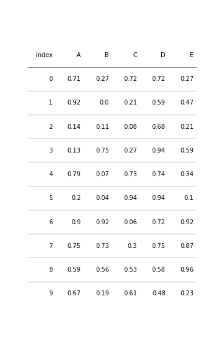
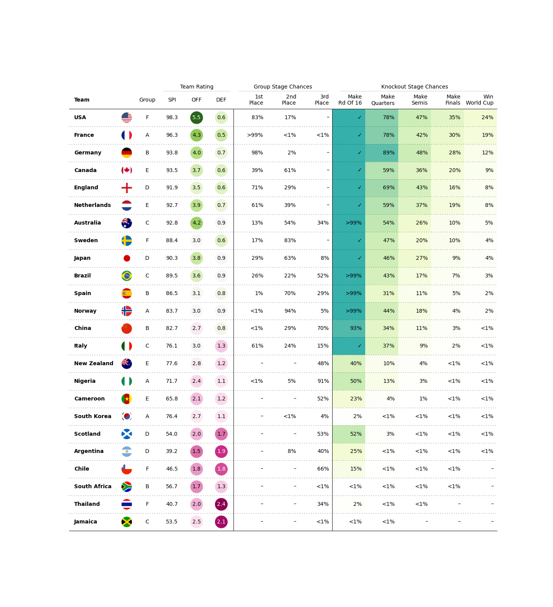

## Beautiful tables in matplotlib.


This is an early version of mpltable. To learn the functionality best take a look at the notebooks in the example folder.
mpltable is inspired by R packages [gt](https://github.com/rstudio/gt) and [reactable](https://github.com/glin/reactable).


### Installation

As it's a very early version, it's not yet available on PyPi. To install clone the repository and install it with pip locally:

```
git clone https://github.com/znstrider/mpltable.git
cd mpltable

pip install .
```

### A Basic Example
```python
import matplotlib.pyplot as plt
import numpy as np
import pandas as pd

from mpltable import Table

d = pd.DataFrame(np.random.random((10, 5)), columns=["A", "B", "C", "D", "E"]).round(2)
fig, ax = plt.subplots(figsize=(5, 8))
tab = Table(d)

plt.show()
```



### Redoing the [Reactable 2019 Women's World Cup Predictions Visualization](https://glin.github.io/reactable/articles/womens-world-cup/womens-world-cup.html)

You can find the [notebook here](https://github.com/znstrider/mpltable/blob/master/example/wwc_example.ipynb)



### Styling A Table

#### The are three ways to customize a table:


##### 1) By supplying keywords to the Table:

```python
"""
Args:
    df (pd.DataFrame):
        A pandas DataFrame with your table data
    ax (mpl.axes.Axes, optional):
        matplotlib axes. Defaults to None.
    index_col (str, optional):
        column to set as the DataFrame index. Defaults to None.
    columns (List[str], optional):
        columns to use. If None defaults to all columns.
    column_definitions (List[mpltable.column_def.ColumnDefinition], optional):
        ColumnDefinitions for columns that should be styled. Defaults to None.
    textprops (Dict[str, Any], optional):
        textprops are passed to each TextCells matplotlib.pyplot.text. Defaults to {}.
    cell_kw (Dict[str, Any], optional):
        cell_kw are passed to to each cells matplotlib.patches.Rectangle patch.
        Defaults to {}.
    col_label_cell_kw (Dict[str, Any], optional):
        col_label_cell_kw are passed to to each ColumnLabels cells
        matplotlib.patches.Rectangle patch. Defaults to {}.
    col_label_divider (bool, optional):
        Whether to plot a divider line below the column labels. Defaults to True.
    footer_divider (bool, optional):
        Whether to plot a divider line below the table. Defaults to False.
    row_dividers (bool, optional):
        Whether to plot divider lines between rows. Defaults to True.
    row_divider_kw (Dict[str, Any], optional):
        row_divider_kw are passed to plt.plot. Defaults to {}.
    col_label_divider_kw (Dict[str, Any], optional):
        col_label_divider_kw are passed to plt.plot. Defaults to {}.
    footer_divider_kw (Dict[str, Any], optional):
        footer_divider_kw are passed to plt.plot. Defaults to {}.
    column_border_kw (Dict[str, Any], optional):
        column_border_kw are passed to plt.plot. Defaults to {}.
    even_row_color (str | Tuple, optional):
        facecolor of the even row cell's patches
    odd_row_color (str | Tuple, optional):
        facecolor of the even row cell's patches   
"""
```


##### 2) Providing a ColumnDefinition for each column you want to style:

```python
class ColumnDefinition:
    """A Class defining attributes for a table column.

    Attributes:
        name: str:
            the column name
        title: str = None:
            the plotted column name
        width: float = 1:
            the width of the column as a factor of the default width
        textprops: Dict[str, Any] = field(default_factory=dict)
            textprops provided to each textcell
        formatter: Callable = None:
            A Callable to format the appearance of the texts
        cmap: Callable = None:
            A Callable that returns a color based on the cells value.
        text_cmap: Callable = None:
            A Callable that returns a color based on the cells value.
        group: str = None:
            Each group will get a spanner column label above the column labels.
        plot_fn: Callable = None
            A Callable that will take the cells value as input and create a subplot
            on top of each cell and plot onto them.
            To pass additional arguments to it, use plot_kw (see below).
        plot_kw: Dict[str, Any] = field(default_factory=dict)
            Additional keywords provided to plot_fn.
        border: str | List = None:
            Plots a vertical borderline.
            can be either "left" / "l", "right" / "r" or "both"
    """


```

and providing them to the Table:
```python
from mpltable import ColumnDefinition

# You can also use the shorthand ColDef
from mpltable import ColDef

d = pd.DataFrame(np.random.random((10, 5)), columns=["A", "B", "C", "D", "E"]).round(2)
fig, ax = plt.subplots(figsize=(6, 10))
tab = Table(d, column_definitions=[ColumnDefinition(name="A", title="Title A", width=2)])

plt.show()
```

#### Plotting onto TableCells:

By providing a plot_fn to a ColumnDefinition, you can have mpltable create an overlay axes that is plotted onto for each of the Columns cells.
The cells value is passed to the plot function.

```python
tab = Table(d, column_definitions=[ColumnDefinition(name="A", plot_fn=plot_fn)])
```

Commonly used example plots are provided in mpltable.plots. You can have a look at them in the [notebook here](https://github.com/znstrider/mpltable/blob/master/example/plots.ipynb).

You can also easily create your own functions. Just make sure to have ax as first and val (the cells value) as second arguments.

```python
def custom_plot_fn(
    ax: matplotlib.axes.Axes,
    val: Any,
    # further arguments that can be passed via plot_kw
    ):
    ...
```

for more complex data you can create a dictionary or function that gets gata based on the cells value, ie.

```python
def custom_plot_fn(
    ax: matplotlib.axes.Axes,
    val: Any,
    # further arguments that can be passed via plot_kw
    ):
    
    data = my_data_dict.get(val)
    or
    data = my_data_getter_function(val)
```

You can create Sparklines, Histograms, ... you name it. 


#### Text Formatters

You can provide a function that takes a cells value as input and outputs a string to be displayed on the table.  
Some basic formatters are provided in mpltable.formatters. It is very easy to create your own formatter functions.

```python
tab = Table(d, column_definitions=[ColumnDefinition(name="A", formatter=formatter)])
```


##### 3) Accessing a tables rows or columns:

Columns are accessed by the column name:
```python
table.columns[column_name]
```

Rows are accessed by their index:
```python
table.rows[idx]
```

After creating a table, you can set cell (rectangle patch) properties and textproperties by accessing functions of the Sequence, ie:

```python
table.columns[column_name].set_facecolor("#f0f0f0")
```

Available functions are:
```
    # rectangle patch setters
    set_alpha
    set_color
    set_edgecolor
    set_facecolor
    set_fill
    set_hatch
    set_linestyle
    set_linewidth

    # fontproperty setters
    set_fontcolor
    set_fontfamily
    set_fontsize
    set_ha
    set_ma
```


##### Lastly there are further Table functions that you can use after instantiating the Table:
```python

set_alternating_row_colors(
    self, color: str | Tuple[float] = None, color2: str | Tuple[float] = None
) -> Table:
    """Sets the color of even row's rectangle patches to `color`.

    Args:
        color (str): color recognized by matplotlib for the even rows 0 ...
        color2 (str): color recognized by matplotlib for the odd rows 1 ...

    Returns:
        Table: mpltable.table.Table
    """


autoset_fontcolors(self, fn: Callable = None, **kwargs) -> Table:
    """Sets the fontcolor of each table cells text based on the facecolor of its rectangle patch.

    Args:
        fn (Callable, optional):
            Callable that takes the rectangle patches facecolor as
            rgba-value as argument.
            Defaults to mpltable.font.contrasting_font_color if fn is None.
        kwargs are passed to fn.

    Returns:
        mpltable.table.Table
    """

```

### Contributing

##### *Contributors are very welcome to this project.*  

You can contribute by giving feedback:

At this stage, **usability** and **clarity** are a main priority.
- If there is something that you think doesn't make sense, is too hard to do, worded badly or should work differently etc., don't hesitate to open an issue or get in touch.

- If there is something you would like mpltable to do, but it currently lacks the functionality, open an issue.

- If you'd like to review the code and have suggestions on how to structure the project better, I'm all ears!

##### You are also very welcome to contribute to the package by creating a Pull Request.

If you are relatively new to contributing to projects or need a refresher on the process, you can read this great [Step-by-step guide to contribute on GitHub](https://www.dataschool.io/how-to-contribute-on-github/) 

If you want to contribute to the project, best use an editable installation:
```
git clone https://github.com/znstrider/mpltable.git
cd mpltable

pip install -e .
```

Any contribution to documentation and examples is also very welcome.