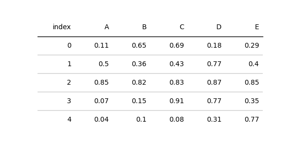
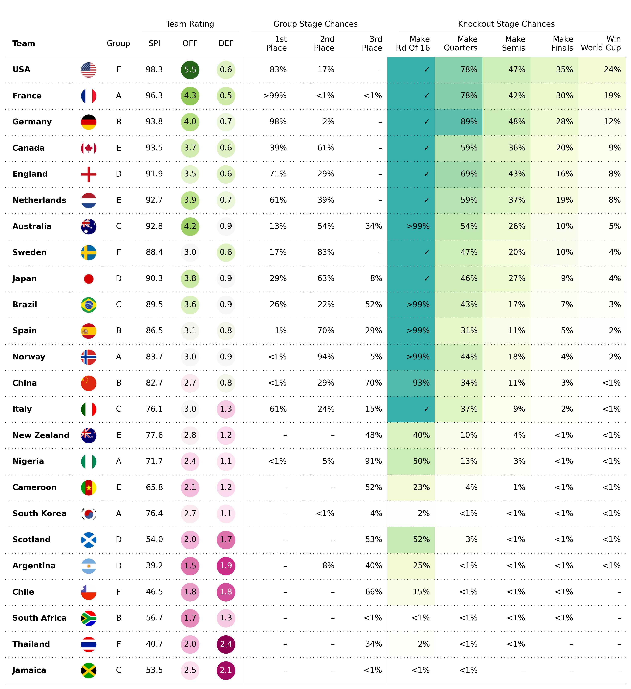

.. plottable documentation master file, created by
   sphinx-quickstart on Sat Oct 29 12:13:32 2022.
   You can adapt this file completely to your liking, but it should at least
   contain the root `toctree` directive.

Welcome to plottable's documentation!
====================================

Beautiful Tables in Matplotlib
------------------------------

plottable is a Python library for plotting beautiful, presentation ready tables in Matplotlib.

Note that this is an early version of plottable. To learn the functionality best take a look at the notebooks in the example folder.

Quick start
-----------

------------
Installation
------------

As it's a very early version, it's not yet available on PyPi. To install clone the repository and install it with pip locally:

.. code-block::

   git clone https://github.com/znstrider/plottable.git
   cd plottable

   pip install .

---------------
A Basic Example
---------------

.. code-block::

   import matplotlib.pyplot as plt
   import numpy as np
   import pandas as pd

   from plottable import Table

   d = pd.DataFrame(np.random.random((10, 5)), columns=["A", "B", "C", "D", "E"]).round(2)
   fig, ax = plt.subplots(figsize=(5, 8))
   tab = Table(d)

   plt.show()

-------------------------
Women's World Cup Example
-------------------------

`You can access the WWC Example Notebook here <example_notebooks/wwc_example.html>`_

.. toctree::
   :maxdepth: 2
   :caption: Documentation:

   notebooks/table.ipynb
   notebooks/column_definition.ipynb
   notebooks/plots.ipynb
   notebooks/cmap.ipynb
   notebooks/formatters.ipynb
   notebooks/font.ipynb
   notebooks/rows_and_columns.ipynb

.. toctree::
   :maxdepth: 2
   :caption: Example Notebooks:

   example_notebooks/basic_example.ipynb
   example_notebooks/wwc_example.ipynb
   example_notebooks/plot_example.ipynb
   example_notebooks/heatmap.ipynb

.. toctree::
   :maxdepth: 2
   :caption: Development:

   dev/contributing
   dev/changelog

.. toctree::
   :maxdepth: 3
   :caption: Contents:

   modules

Credits
=======

plottable is built for the lack of good table packages in the python ecosystem.
It draws inspiration from R packages `gt <https://github.com/rstudio/gt>`_ and `reactable <https://github.com/glin/reactable>`_, from blog posts about creating tables in matplotlib `Tim Bayer: How to create custom tables <https://matplotlib.org/matplotblog/posts/how-to-create-custom-tables/>`_ and `Son of a corner: Beautiful Tables in Matplotlib, a Tutorial <https://www.sonofacorner.com/beautiful-tables/>`_ and from matplotlibs own table module.

Indices and tables
==================

* :ref:`genindex`
* :ref:`modindex`
* :ref:`search`
